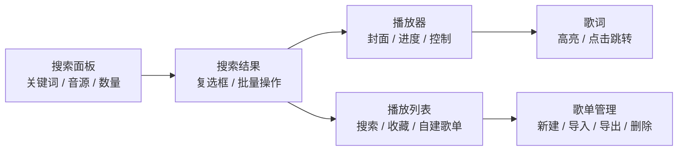
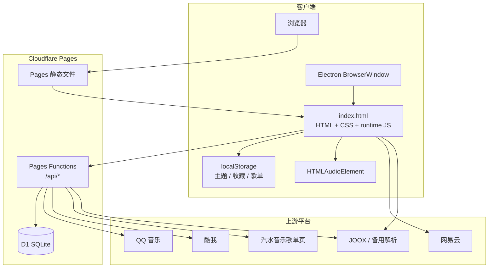
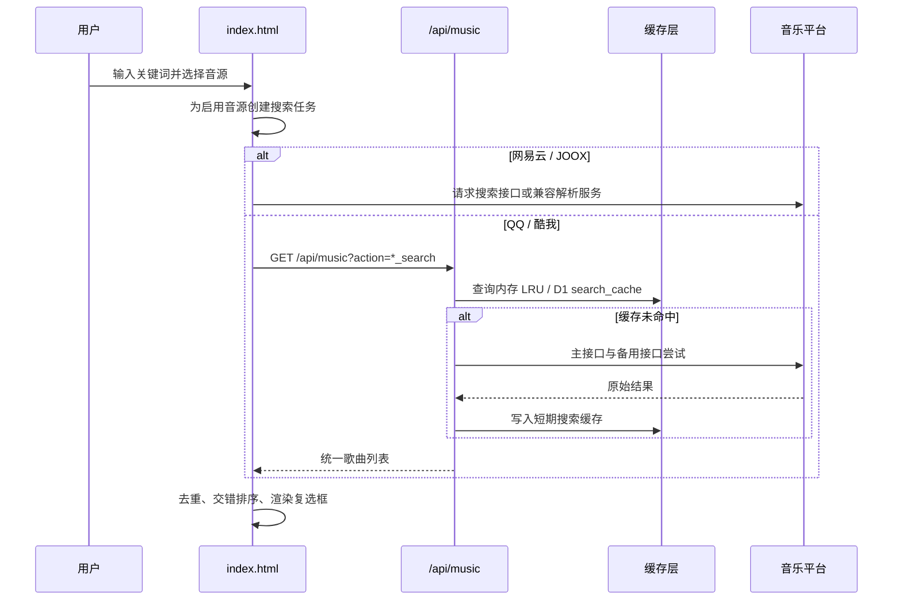
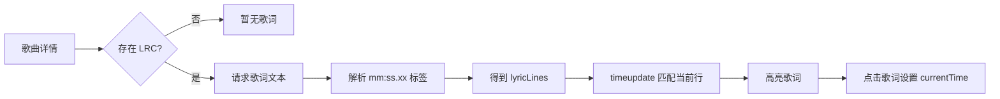

# HALO Music

<p align="center">
  
</p>

<p align="center"><strong>多音源搜索、在线播放、歌词同步与歌单管理</strong></p>

HALO Music 是一个基于 Cloudflare Pages、Pages Functions 和 D1 的在线音乐应用，同时提供 Electron 桌面客户端。它把多个平台的搜索结果统一成 HALO Track 数据结构，在浏览器端完成搜索、播放、歌词和歌单交互，在服务端负责鉴权、缓存、音频解析和公开歌单导入。

> 本项目用于学习、研究和演示。音乐内容、音频地址及相关版权归对应平台和原作者所有，请遵守当地法律、上游平台服务条款与版权政策。

## 目录

- [功能概览](#功能概览)
- [界面与交互](#界面与交互)
- [系统架构](#系统架构)
- [目录结构](#目录结构)
- [核心数据流](#核心数据流)
- [后端 API](#后端-api)
- [数据模型与持久化](#数据模型与持久化)
- [安全设计](#安全设计)
- [本地开发](#本地开发)
- [数据库初始化](#数据库初始化)
- [测试](#测试)
- [Electron 桌面端](#electron-桌面端)
- [配置与部署说明](#配置与部署说明)
- [常见问题](#常见问题)
- [限制与后续方向](#限制与后续方向)

## 功能概览

| 模块 | 能力 | 主要实现 |
| --- | --- | --- |
| 多源搜索 | 网易云、QQ 音乐、酷我、JOOX；按音源勾选、分页加载、交错展示 | `index.html`、`/api/music` |
| 播放器 | 播放/暂停、切歌、进度拖动、音量、静音、列表/单曲/随机播放 | `index.html` |
| 歌词 | LRC 时间轴解析、动态高亮、点击歌词跳转到时间点 | `index.html`、`/api/music` |
| 收藏 | 单曲收藏、搜索结果批量收藏、收藏列表 | `index.html`、`/api/library` |
| 自建歌单 | 新建、删除、导入、导出、添加/移除歌曲 | `index.html`、`/api/library` |
| 歌单导入 | 网易云、汽水音乐、QQ 音乐公开歌单链接，以及 HALO JSON | `functions/api/import-playlist.js` |
| 账号 | 注册、登录、退出、30 天会话、D1 库同步 | `functions/api/*.js` |
| 缓存 | 搜索缓存、音源解析缓存、内存 LRU、D1 二级缓存 | `functions/api/music.js`、`schema.sql` |
| 桌面端 | Electron 原生窗口、外链交给系统浏览器、Windows 安装包/便携版 | `electron/`、`package.json` |

## 界面与交互

### 桌面端布局

桌面端是三栏工作区：左侧搜索，中间播放器与歌词，右侧播放列表。右侧歌单面板包含“搜索结果”“我的收藏”“自建歌单”三个标签；不同标签会切换歌曲列表、歌单选择器和管理操作。



### 移动端布局

移动端通过底部导航切换“搜索 / 歌词 / 我的”。歌单概览使用卡片，进入歌单后显示可滚动歌曲列表；媒体查询会重新组织间距、按钮尺寸和滚动区域，而不是简单压缩桌面三栏。

### 交互规则

1. 搜索结果默认显示复选框；全选、收藏和歌单操作只作用于当前搜索结果。
2. 空结果时点击批量操作会提示暂无搜索结果；未选歌曲时会提示先选择歌曲。
3. 点击歌曲行会播放对应歌曲；点击歌词行会把 `audio.currentTime` 跳到该歌词的时间戳。
4. 未登录用户可以搜索和浏览；解析音频并开始播放需要登录。
5. 收藏和歌单先写入浏览器本地缓存；登录用户再异步同步到 D1，弱网时仍可使用本地数据。

## 系统架构



### 分层职责

- **展示层**：`index.html` 包含页面结构、响应式 CSS、主题和国际化文案。
- **交互状态层**：运行时 `state` 保存搜索、播放、歌词、登录、收藏、歌单和批量选择状态。
- **音源适配层**：客户端和 `functions/api/music.js` 把不同平台字段归一化成歌曲对象。
- **鉴权层**：`_auth.js` 提供密码哈希、Cookie 会话、用户识别和统一 JSON 响应。
- **持久化层**：D1 存储用户、会话、云端歌单以及搜索/音频缓存；localStorage 提供本地兜底。
- **桌面壳层**：Electron 提供安全的原生窗口，不把 Node 能力暴露给页面。

## 目录结构

```text
.
├─ index.html                 # Pages 入口：页面、样式和浏览器端运行时
├─ app.js                     # 前端辅助脚本/兼容代码
├─ styles.css                 # 可复用样式资源
├─ functions/api/
│  ├─ _auth.js                # PBKDF2、Cookie、会话校验、JSON 响应
│  ├─ login.js                # POST /api/login
│  ├─ register.js             # POST /api/register
│  ├─ logout.js               # POST /api/logout
│  ├─ me.js                   # GET /api/me
│  ├─ library.js              # GET/PUT /api/library
│  ├─ music.js                # 搜索、详情、音频解析、缓存和代理
│  └─ import-playlist.js      # POST /api/import-playlist
├─ electron/
│  ├─ main.cjs                # BrowserWindow 生命周期和安全策略
│  └─ preload.cjs             # contextBridge 暴露最小桌面信息
├─ schema.sql                 # D1 表、索引和缓存表
├─ wrangler.toml              # Pages 与 D1 绑定配置
├─ _routes.json               # 仅将 /api/* 路由交给 Functions
├─ *test.js                   # Node 原生测试：鉴权、导入、播放和音源
├─ icon.svg                   # 应用图标
├─ contact.JPG / donate.JPG   # 联系与赞助弹窗资源
└─ package.json               # npm、Wrangler、Electron 和打包脚本
```

## 核心数据流

### 搜索流程



### 播放流程

1. 点击歌曲行后，页面更新 `state.currentTrack` 和 `state.playContext`。
2. 客户端检查已有详情、音频地址和预加载的下一首歌曲。
3. 需要服务端解析时请求 `/api/music?action=qq_audio|kuwo_audio`。
4. 服务端优先复用缓存并验证候选音频；失败时客户端可刷新解析或切换备用音源。
5. 最终 URL 设置到 `<audio>`，`timeupdate` 同步驱动进度条、歌词高亮和当前歌曲样式。

### 歌词流程



## 后端 API

所有 Functions 位于 `functions/api/`，由 Cloudflare Pages 按文件名映射为 `/api/*`。除公开搜索外，用户库接口要求有效的 `hm_token` 会话 Cookie。

| 方法 | 路径 | 是否登录 | 作用 |
| --- | --- | --- | --- |
| `POST` | `/api/register` | 否 | 创建账号并立即写入会话 Cookie |
| `POST` | `/api/login` | 否 | 校验账号密码并创建会话 |
| `POST` | `/api/logout` | 否 | 删除当前会话并清理 Cookie |
| `GET` | `/api/me` | 否 | 返回当前用户名，未登录返回 401 |
| `GET` | `/api/library` | 是 | 读取当前用户收藏和歌单 |
| `PUT` | `/api/library` | 是 | 校验并覆盖用户收藏和歌单 |
| `POST` | `/api/import-playlist` | 是 | 服务端解析公开歌单分享链接 |
| `GET` | `/api/music` | 否 | 搜索、详情、音频解析、代理和缓存 |

### `/api/music` 常用 action

| `action` | 主要参数 | 说明 |
| --- | --- | --- |
| `qq_search` | `q`, `limit` | QQ 音乐搜索，含官方接口和备用源 |
| `kuwo_search` | `q`, `limit` | 酷我搜索，含官方接口和备用源 |
| `qq_detail` / `kuwo_detail` | `id` 及音源字段 | 获取详情、封面、歌词或可播放信息 |
| `qq_audio` / `kuwo_audio` | `id`, `duration`, `refresh` | 解析并验证可播放音频 |

服务端会限制关键词长度、返回数量和上游请求时间，避免单个平台异常拖垮整次请求。

## 数据模型与持久化

### HALO Track

```js
{
  uid: "qq-歌曲标识",
  source: "qq",                 // netease / qq / kuwo / joox
  title: "歌曲名",
  artist: "歌手",
  album: "专辑",
  cover: "https://...",
  songid: "平台歌曲 ID",
  quality: "lossless",
  qualityLabel: "无损",
  pay: "",
  audioUrl: null,                // 运行时字段，不写入云端库
  lrc: null                      // 运行时歌词，不写入云端库
}
```

`serializeTrack()` 会过滤短时效音频 URL、歌词和详情状态，只保存可复用的标识与展示字段，避免把临时资源写入 localStorage 或 D1。

### D1 表

| 表 | 关键字段 | 用途 |
| --- | --- | --- |
| `music_users` | `username`, `password_hash`, `password_salt` | 账号与密码材料 |
| `music_sessions` | `token`, `username`, `expires_at` | 30 天登录会话 |
| `music_libraries` | `username`, `library_json`, `updated_at` | 用户收藏和自建歌单 JSON |
| `music_cache` | `key`, `value_json`, `expires_at` | 音频/详情共享缓存 |
| `search_cache` | `key`, `value_json`, `expires_at` | 搜索结果短期缓存 |

### 缓存策略

- 内存层使用 `Map` 实现 LRU，最多保留约 500 个条目。
- 搜索缓存默认约 45 秒，吸收短时间内的重复搜索。
- 音频解析缓存默认按较长周期保存；失效时可用 `refresh=1` 重新解析。
- D1 是跨请求、跨 Worker 实例的共享缓存层；过期数据按惰性策略清理。
- 用户库采用“localStorage 先落地、D1 异步同步”，兼顾离线和多设备使用。

## 安全设计

### 账号与会话

- 用户名限制为 3–20 位字母、数字、下划线或中文。
- 密码至少 8 位。
- 使用 Web Crypto PBKDF2-SHA-256、100,000 次迭代和 16 字节随机 salt。
- 服务端只保存哈希和 salt，不保存明文密码。
- 会话 token 使用随机 UUID，写入 `HttpOnly; Secure; SameSite=Lax` Cookie。
- 会话默认有效期 30 天，过期访问会清理数据库记录。

### Electron 安全边界

`BrowserWindow` 配置了 `contextIsolation: true`、`nodeIntegration: false` 和 `sandbox: true`。Preload 只通过 `contextBridge` 暴露平台名和 Electron 版本；外部链接交给系统默认浏览器打开。

## 本地开发

### 环境要求

- Node.js 20 LTS 或更高版本
- npm
- Cloudflare Wrangler 4（已包含在开发依赖中）
- Windows 桌面打包需要 Electron Builder 支持的 Windows 环境

### 安装依赖

```powershell
npm install
```

### 启动本地 Pages

先初始化本地 D1：

```powershell
npx wrangler d1 execute halo-music-db --local --file schema.sql
```

然后启动 Pages 和 Functions：

```powershell
npm run dev
```

打开 Wrangler 输出的本地地址即可访问。首次使用请在页面注册本地账号；项目不内置通用测试账号和密码。

## 数据库初始化

创建远程 D1 并记录返回的 `database_id`：

```powershell
npx wrangler d1 create halo-music-db
```

把 ID 写入 `wrangler.toml`，再初始化远程表：

```powershell
npx wrangler d1 execute halo-music-db --remote --file schema.sql
```

`wrangler.toml` 的核心绑定如下：

```toml
name = "halo-music"
compatibility_date = "2025-01-01"
pages_build_output_dir = "."

[[d1_databases]]
binding = "DB"
database_name = "halo-music-db"
database_id = "替换为你的 D1 database_id"
```

## 测试

项目使用 Node.js 原生 `node:test`：

```powershell
npm test
```

测试覆盖：

- 注册、登录、会话和登出数据库流程
- 收藏和自建歌单按用户持久化
- 网易云、QQ、酷我、JOOX、汽水音乐字段归一化
- 歌单分享链接识别与导入
- QQ 签名算法和分页请求体
- LRC 时间标签清洗与歌词切分
- 音频容器识别、时长估算和播放上下文切歌
- 浏览器端内联脚本语法检查

提交前还可以检查补丁格式：

```powershell
git diff --check
```

## Electron 桌面端

桌面客户端使用原生窗口加载 Pages 应用，不重复实现一套播放器：

```text
Electron main process
        │
        ├─ BrowserWindow（默认 1440×920，最小 960×640）
        ├─ preload.cjs（最小化 contextBridge）
        └─ loadURL(HALO_MUSIC_URL 或默认 Pages 地址)
```

启动开发窗口：

```powershell
npm run desktop:dev
```

构建 Windows NSIS 安装包：

```powershell
npm run desktop:all
```

构建便携版：

```powershell
npm run desktop:portable
```

产物写入 `release/`。应用 ID 为 `com.halomusic.desktop`，产品名为 `HALO Music`，图标来自 `icon.svg`。

## 配置与部署说明

本 README 只记录配置方式，不代表本次开发会自动部署。项目脚本如下：

| 命令 | 作用 |
| --- | --- |
| `npm run dev` | Wrangler Pages 本地开发 |
| `npm run deploy` | 部署 Pages（需要明确执行） |
| `npm test` | 执行 Node 原生测试 |
| `npm run desktop:dev` | 启动 Electron 开发窗口 |
| `npm run desktop:all` | 构建 Windows NSIS 安装包 |
| `npm run desktop:portable` | 构建 Windows 便携版 |

Electron 地址可以通过环境变量覆盖：

```powershell
$env:HALO_MUSIC_URL = "https://your-project.pages.dev"
npm run desktop:dev
```

也可以使用命令行参数：

```powershell
npx electron . --url=https://your-project.pages.dev
```

## 常见问题

### 为什么搜索能用但播放提示登录？

搜索和浏览是公开能力；音频详情解析和播放需要认证。请先注册或登录，本地环境没有预置账号。

### 为什么收藏刷新后还在，但另一台设备没有？

未登录时数据只在当前浏览器 localStorage。登录后页面会同步到 `/api/library`，不同设备需要使用同一账号。

### 为什么导入 QQ 歌单数量有限？

服务端为了控制请求时间、上游压力和 Pages Function 限制，QQ 歌单最多导入前 1,200 首；网易云最多处理 2,000 首，汽水音乐页面解析上限为 4 MB。

### 为什么播放地址不能永久保存？

部分平台返回的是短时效地址。项目保存平台歌曲标识和已验证候选信息，不把临时音频 URL 当作永久资源；播放失败时会重新解析。

### D1 报“binding 缺失”怎么办？

检查 `wrangler.toml` 是否存在 `[[d1_databases]]`、`binding` 是否为 `DB`，并确认本地或远程 D1 已执行 `schema.sql`。

### 如何确认没有部署？

`npm run deploy` 是独立脚本，不会被 `npm test`、`npm run dev` 或编辑 README 自动调用。查看 Git 工作区和 Wrangler 输出即可确认本次是否发生外部部署。

## 限制与后续方向

1. 上游平台接口、字段和音频地址可能变化，需要持续维护适配器和备用源。
2. Pages Functions 的请求时间和上游限流会影响大批量搜索、歌词和歌单导入。
3. 当前前端主入口仍集中在 `index.html`，后续可以拆分为模块化组件、状态模块和样式文件。
4. 当前自动化测试以协议、解析和状态逻辑为主，后续可以加入 Playwright 视觉回归基线。
5. 用户库目前以 JSON 保存；若要支持协作歌单、增量同步或审计，可拆分为歌曲、歌单和关系表。

## 许可证与第三方声明

项目许可证见 [LICENSE](LICENSE)，第三方服务和代码说明见 [THIRD_PARTY_NOTICES.md](THIRD_PARTY_NOTICES.md)。
